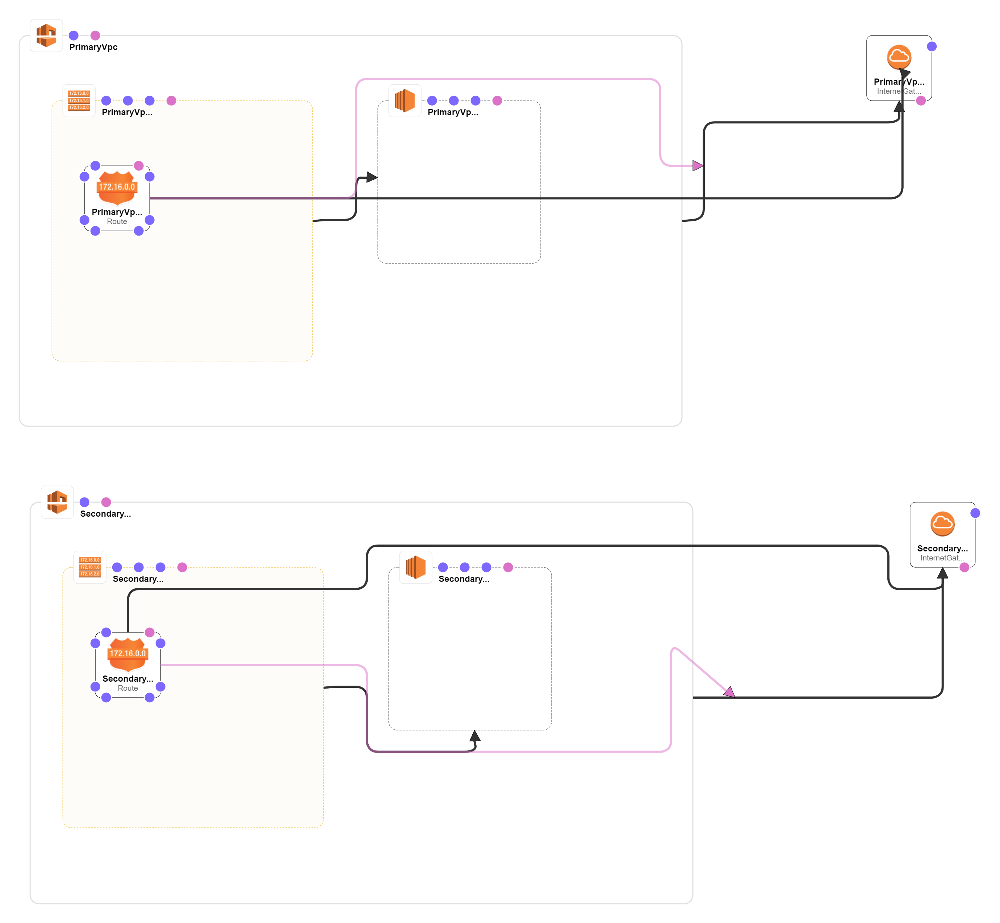

# AWS Project 1

## Part 1: Data Durability And Recovery

### Data Durability And Recovery
1. Pick two AWS regions. An active region and a standby region.
2. Use CloudFormation to create one VPC in each region. Name the VPC in the active region "Primary" and name the VPC in the standby region "Secondary".

**NOTE**: Be sure to use different CIDR address ranges for the VPCs.

**Answer**
The VPCs are creating via this Yaml template [link](vpc.yaml)
The next figure represents the diagram of the Yaml template in AWS Designer.  


Sources
* https://docs.aws.amazon.com/solutions/latest/multi-region-infrastructure-deployment/welcome.html
* https://aws.amazon.com/solutions/implementations/multi-region-infrastructure-deployment/
* https://www.youtube.com/watch?v=k9_9bDZa_EI
* https://www.youtube.com/watch?v=3K9AzSrCmiQ
* https://docs.aws.amazon.com/AWSCloudFormation/latest/UserGuide/what-is-cfnstacksets.html
* https://www.youtube.com/watch?v=ZzD9I8ur6lg


### Highly durable RDS Database
1. Create a new RDS Subnet group in the active and standby region using private subnets.
2. Create a new MySQL, multi-AZ database in the active region. The database must:
   1. Be a “burstable” instance class.
   2. Have only the “UDARR-Database” security group.
   3. Have an initial database called “udacity.”
3. Create a read replica database in the standby region. This database has the same requirements as the database in the active region.

**SAVE** screenshots of the configuration of the databases in the active and secondary region after they are created. Also, save screenshots of the configuration of the database subnet groups as well as route tables associated with those subnets
### Availability Estimate

Write a paragraph or two describing the achievable Recovery Time Objective (RTO) and Recovery Point Objective (RPO) for this Multi-AZ, multi-region database in terms of:
1. Minimum RTO for a single AZ outage
2. Minimum RTO for a single region outage
3. Minimum RPO for a single AZ outage
4. Minimum RPO for a single region outage

### Demonstrate normal usage
In the active region:

1. Create an EC2 keypair in the region
2. Launch an Amazon Linux EC2 instance in the active region. Configure the instance to use the VPC's public subnet and security group ("UDARR-Application").
3. SSH to the instance and connect to the "udacity" database in the RDS instance.
4. Verify that you can create a table, insert data, and read data from the database.
5. You have now demonstrated that you can read and write to the primary database

### Monitor database

1. Observe the “DB Connections” to the database and how this metric changes as you connect to the database
2. Observe the “Replication” configuration with your multi-region read replica.

**SAVE** screenshots of the DB Connections and the database replication configuration. Name your screenshots:

# Recoverability in AWS

## Relational Database Resilience

### SWBAT build networks that will continue to operate through the loss of a single data center
```
Screenshot of successfully created VPCs in two different AWS regions
```

### SWBAT build systems that align to a business availability objectives for redundancy.
* Screenshot of a MySQL database configured to run in multiple availability zones in the "Primary" VPC. Database must have automatic backups enabled and be in a private subnet.
* Screenshot of route tables for the configured database subnets

### SWBAT build systems that align to business availability objectives for resiliency
* Screenshot of a read-replica MySQL database configured to run in the "Secondary" VPC. Database must be in a private subnet.
* Screenshot of route tables for the configured database subnets